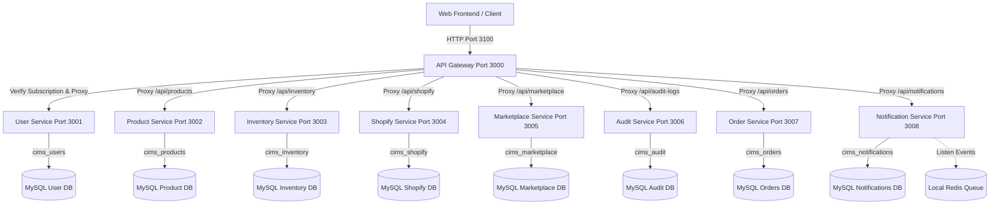
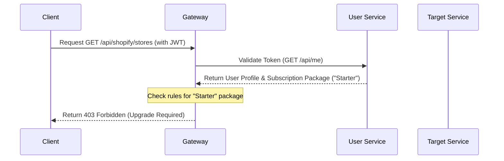
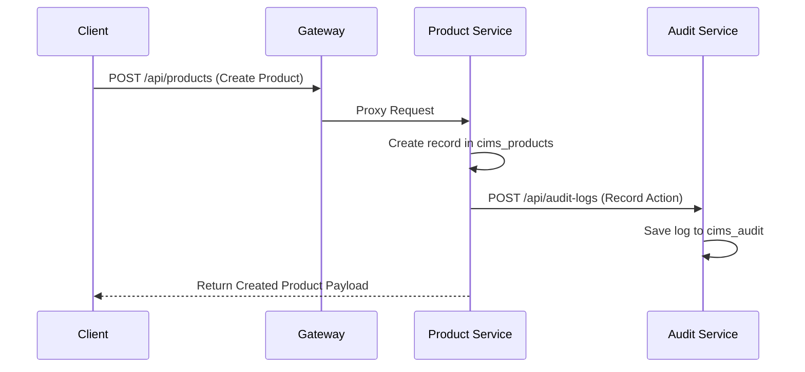

# CIMS Microservices Architecture & Data Flow Report

This document provides a comprehensive technical overview of the Channel & Inventory Management System (CIMS) microservices architecture, covering both High-Level (system topology, SaaS multi-tenancy, cross-service interactions) and Low-Level (service structures, routing routes, Prisma schemas, role/subscription restrictions) designs.

---

## 1. High-Level Architecture

### 1.1 Gateway Routing & Proxying
The **API Gateway** acts as the single public entry point for all API requests.
- Port: `3000`
- Route Redirection: It intercepts all requests starting with `/api` and routes them downstream to the correct microservice using path prefixes.
- CORS: Enabled to allow cross-origin requests from the Frontend (running on port `3100`).

### 1.2 SaaS Subscription & Tenant Boundaries
- **SaaS Tenancy Model**: Database-per-service multi-tenant architecture. Every microservice connects to its own independent MySQL database on localhost (port `3306`).
- **Tenant Isolation**: Achieved logically by associating all operational models with a `companyId` (extracted from the user's active session/company membership). 
- **Subscription Gatekeeping**: The API Gateway intercepts requests to `/api/*` and pings the User Service (`/api/me`) using the client's JWT token to resolve their active company plan. Routes are blocked or permitted dynamically depending on their active subscription package.

### 1.3 Inter-Service Communication
1. **Synchronous (HTTP)**: Used primarily for gateway-to-service validation (such as fetching subscription profiles from the User Service).
2. **Asynchronous (Redis Pub/Sub)**: Used for event-driven flows such as sending background notifications or triggering synchronization logs without delaying client requests.

---

## 2. Low-Level Architecture & Routing

### 2.1 Microservice Port Allocation
Each microservice is built using the NestJS framework and runs locally on a designated port:

| Service Name | Port | Database Name | Description |
| :--- | :---: | :--- | :--- |
| **API Gateway** | `3000` | *None* | Routing Proxy, CORS, Subscription enforcement |
| **User Service** | `3001` | `cims_users` | Accounts, authentication, companies, team roles, packages |
| **Product Service** | `3002` | `cims_products` | Inventory catalog, brands, categories, attributes, suppliers |
| **Inventory Service** | `3003` | `cims_inventory` | Warehouses, current stock levels, transaction logs |
| **Shopify Service** | `3004` | `cims_shopify` | Store connection, sync logs, credentials |
| **Marketplace Service** | `3005` | `cims_marketplace` | Platform connections (Shopify, Amazon, eBay, Walmart, Etsy), listings |
| **Audit Service** | `3006` | `cims_audit` | Immutable logs tracking core database changes |
| **Order Service** | `3007` | `cims_orders` | External order tracking, customer information, line items |
| **Notification Service**| `3008` | `cims_notifications` | User/system alert queues, email triggers |

---

## 3. Database Schemas & Relations

Each service uses its own Prisma database client. Below is a detailed mapping of schemas:

### 3.1 User Service (`cims_users`)
- **User**: Core profile (email, password, status, Google authentication details).
- **Company**: Tenant entity linked to packages and memberships.
- **Membership**: Junction table mapping `User` to `Company` with a specific `Role`.
- **Role**: Platform authorization level (`SUPER_ADMIN`, `BUSINESS_ADMIN`, `TEAM_MANAGER`, `TEAM_MEMBER`, `VIEWER`).
- **Permission**: Operational action permissions (e.g., `product:create`).
- **Package**: Available SaaS plans (`Starter`, `Pro`, `Enterprise`).
- **Subscription**: Maps a company to a `Package` with expiry/trial states.
- **Payment**: Payment ledger (amount, status, transaction details).

### 3.2 Product Service (`cims_products`)
- **Product**: Product listings with type (`SIMPLE`, `VARIANT`), status, pricing, dimensions.
- **ProductAttribute**: Dynamic properties (e.g., brand or material).
- **Variant**: Specific variations (sizes/colors) linked to a parent Product.
- **VariantAttribute**: Junction table mapping attributes to variants.
- **Category / Brand**: Classifications scoped by `companyId`.
- **Supplier**: Details of vendors providing stock.
- **ProductSupplier**: Junction table mapping Products to Suppliers with lead times and default settings.

### 3.3 Inventory Service (`cims_inventory`)
- **StockLevel**: Maps a `variantId` (from Product Service) to a `Warehouse` with quantities, reserved units, reorder levels, and bin locations.
- **Warehouse**: Physical warehouse locations.
- **StockTransaction**: Log of inventory modifications (`IN`, `OUT`, `RESERVE`, `RELEASE`, `ADJUSTMENT`).

### 3.4 Shopify Service (`cims_shopify`)
- **ShopifyStore**: Authorized shop connections, API keys, sync status.
- **ShopifyLog**: Logs tracking sync transactions and errors.

### 3.5 Marketplace Service (`cims_marketplace`)
- **Channel**: Platforms configured for a tenant (e.g., Amazon, Walmart).
- **Listing**: Relates a specific `stockItemId` & `variantId` to a sales `Channel` with custom pricing, quantity allocated, and sync status.

### 3.6 Audit Service (`cims_audit`)
- **AuditLog**: Unified immutable history tracking changes (e.g., action type, entity model, old values, new values).

### 3.7 Order Service (`cims_orders`)
- **Order**: Customer order header (total amount, customer name, status).
- **OrderItem**: Purchase line items mapping to product `variantId` and quantities.

### 3.8 Notification Service (`cims_notifications`)
- **Notification**: Alerts queued for users (`EMAIL`, `SYSTEM`).

---

## 4. Operational Data Flows

### 4.1 SaaS Subscription Gatekeeping Flow

### 4.2 Product Synchronization & Audit Logging

